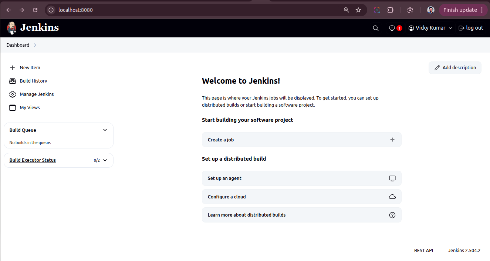

# `DevOps`




## 🔧 Prerequisites (Install Once)

### 🖥️ Install on Ubuntu/Debian

```bash
# Docker
sudo apt update && sudo apt install docker.io -y

# Minikube
curl -LO https://storage.googleapis.com/minikube/releases/latest/minikube-linux-amd64
sudo install minikube-linux-amd64 /usr/local/bin/minikube

# kubectl (Kubernetes CLI)
sudo apt install -y kubectl
```

---

## ✅ Step 1: Create Project Directory

```bash
mkdir flask-k8s-demo && cd flask-k8s-demo
```

---

## ✅ Step 2: Write Flask App

**`app.py`**:

```python
from flask import Flask
app = Flask(__name__)

@app.route("/")
def hello():
    return "Hello, Kubernetes!"

if __name__ == "__main__":
    app.run(host="0.0.0.0", port=5000)
```

---

## ✅ Step 3: Write `requirements.txt`

```txt
flask
```

---

## ✅ Step 4: Write Dockerfile

**`Dockerfile`**:

```Dockerfile
FROM python:3.12-slim
WORKDIR /app
COPY requirements.txt .
RUN pip install -r requirements.txt
COPY app.py .
EXPOSE 5000
CMD ["python", "app.py"]
```

---

## ✅ Step 5: Write Kubernetes Manifests

### 📄 `deployment.yaml`

```yaml
apiVersion: apps/v1
kind: Deployment
metadata:
  name: flask-deployment
spec:
  replicas: 1
  selector:
    matchLabels:
      app: flask
  template:
    metadata:
      labels:
        app: flask
    spec:
      containers:
      - name: flask
        image: flask-hello-k8s
        imagePullPolicy: Never
        ports:
        - containerPort: 5000
```

### 📄 `service.yaml`

```yaml
apiVersion: v1
kind: Service
metadata:
  name: flask-service
spec:
  type: NodePort
  selector:
    app: flask
  ports:
  - port: 80
    targetPort: 5000
    nodePort: 30001
```

---

## ✅ Step 6: Start Minikube

```bash
minikube start
```

---

## ✅ Step 7: Build Docker Image and Load into Minikube

```bash
# Tell Docker to build for Minikube
eval $(minikube docker-env)

# Build your Docker image
docker build -t flask-hello-k8s .

# Load into Minikube’s container registry
minikube image load flask-hello-k8s
```

---

## ✅ Step 8: Deploy to Kubernetes

```bash
kubectl apply -f deployment.yaml
kubectl apply -f service.yaml
```

---

## ✅ Step 9: Access Your App

```bash
minikube service flask-service
```

It will open something like:

```
http://192.168.49.2:30001
```

---

## ✅ Step 10: Set Up Jenkins in Docker

```bash
docker run -d --name jenkins \
  -p 8080:8080 -p 50000:50000 \
  -v jenkins_home:/var/jenkins_home \
  -v /var/run/docker.sock:/var/run/docker.sock \
  -v $HOME/.kube:/root/.kube \
  -v $HOME/.minikube:/root/.minikube \
  jenkins/jenkins:lts
```

---

## ✅ Step 11: Configure Jenkins Job (via UI)

* Go to: [http://localhost:8080](http://localhost:8080)
* Unlock Jenkins:

  ```bash
  docker exec jenkins cat /var/jenkins_home/secrets/initialAdminPassword
  ```
* Install Suggested Plugins
* Create Admin User

---

### 🔨 Create Freestyle Project: `flask-k8s-deploy`

**In “Build Steps → Execute Shell”, paste:**

```bash
#!/bin/bash

# Use Docker inside Minikube
eval $(minikube docker-env)

# Build Docker image
docker build -t flask-hello-k8s .

# Load it into Minikube
minikube image load flask-hello-k8s

# Apply manifests
kubectl apply -f deployment.yaml
kubectl apply -f service.yaml

# Show pod status
kubectl get pods

# Show service URL
minikube service flask-service --url
```

---

## ✅ Final Result

You’ve now automated the entire process:

* Flask App ➝ Docker Image ➝ Kubernetes ➝ NodePort ➝ Jenkins CI
